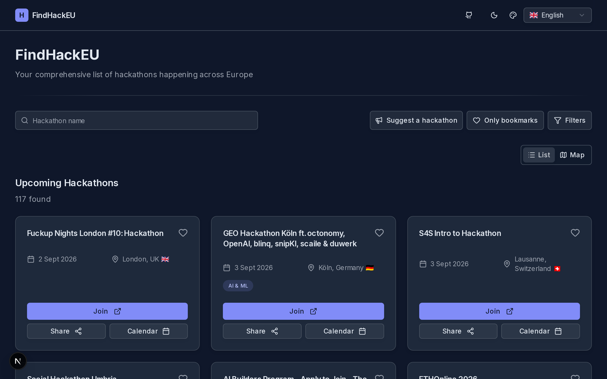

# FindHackEU


FindHackEU is an independent, open-source directory of hackathons across Europe, maintained by Gabriele Viganò. A scheduled pipeline pulls event listings from Luma, Devfolio, MLH, ETHGlobal, Eventbrite, and Devpost; normalizes and deduplicates them across sources; enriches location data with geocoding; and publishes the result as a searchable, mappable website and a public JSON API — all built and run in the open.



## Table of contents

- [What you can use](#what-you-can-use)
- [Run locally](#run-locally)
- [Project map](#project-map)
- [Useful commands](#useful-commands)
- [Origin and stewardship](#origin-and-stewardship)

## What you can use

- **The public website** — filter hackathons by text, date range, topic, city/country, and travel radius; browse them on a clustered map; and bookmark events locally in your browser (no account needed).
- **The public read API** — `GET /api/hackathons` returns approved, non-archived events as JSON, with optional `status`, cursor, and limit parameters.
- **Community discovery** — know about a hackathon the pipeline missed? Submit its URL through the site. It lands in a moderation queue and is reviewed by a maintainer before it ever goes live — nothing is auto-published from a raw web search or a public submission.

Discord/Telegram/Twitter notification bots exist in the codebase but are currently unconfigured and inactive in production.

## Run locally

Prerequisites: a current Node.js installation and [Docker](https://www.docker.com/) (for local Supabase).

```bash
git clone https://github.com/viganogabriele/FindHackEU.git
cd FindHackEU
npm install
cp .env.example .env.local
npx supabase start
```

`supabase start` boots a local Postgres/Studio stack, applies the repository's migrations, and loads `supabase/seed.sql` — a small set of realistic, clearly-fake sample hackathons and moderation-queue candidates, so the site and `/admin` have something to look at immediately with zero API keys configured. Copy the API URL, anon key, and service-role key it prints into `.env.local` as `NEXT_PUBLIC_SUPABASE_URL`, `NEXT_PUBLIC_SUPABASE_ANON_KEY`, and `SUPABASE_SERVICE_ROLE_KEY`, set `CRON_SECRET` to any value you choose, then start the app:

```bash
npm run dev
```

The local `/admin` moderation dashboard needs no Google OAuth setup by default: leave `GOOGLE_CLIENT_ID` and `ADMIN_ALLOWED_EMAIL` unset and it falls back to an open local-dev bypass. That bypass only ever activates outside production — see `lib/services/require-admin-auth.ts` and `docs/admin-auth-setup.md` if you want real sign-in locally too.

To actually populate data, trigger the discovery pipeline against your local Supabase instance with `npm run trigger-update` (see [`.env.example`](./.env.example) for the optional geocoding/search API keys that unlock location enrichment and web-search discovery).

## Project map

- `app/` — App Router pages and API routes, including the public listing UI and `/admin` moderation dashboard.
- `lib/parsers/` — one module per event source (Luma, Devfolio, MLH, ETHGlobal, Eventbrite, Devpost), each implementing a shared `Provider` contract.
- `lib/dedup/` — URL normalization and fuzzy title/date matching used to merge duplicate listings across sources.
- `lib/discovery/` and `lib/search/` — the moderated web-search discovery pipeline, kept structurally separate from the provider parsers above.
- `lib/services/` — ingestion orchestration, geocoding, persistence, and moderation logic.
- `supabase/migrations/` — the full database schema, checked in so a local instance matches production exactly.

Every stage of the ingestion pipeline reports its own status independently, so one source failing (a site redesign, a rate limit) never blocks the others from completing. Web-search-derived candidates stay entirely separate from the published dataset until a maintainer explicitly approves them — there is no path from a raw search result to a live listing that skips human review.

## Useful commands

| Command                  | Purpose                                                          |
| ------------------------ | ---------------------------------------------------------------- |
| `npm run dev`            | Start the development server.                                    |
| `npm run lint`           | Run ESLint.                                                      |
| `npm run test`           | Run the Vitest test suite.                                       |
| `npx tsc --noEmit`       | Type-check the project.                                          |
| `npm run build`          | Build for production.                                            |
| `npm run trigger-update` | Run the discovery pipeline against your local Supabase instance. |

For architecture and environment details, see [CLAUDE.md](./CLAUDE.md), [AGENTS.md](./AGENTS.md), and [.env.example](./.env.example). Product and API documentation lives at `/docs` on the running site. To deploy your own instance to Vercel + Supabase, see [`docs/production-deployment.md`](./docs/production-deployment.md).

## Origin and stewardship

FindHackEU acknowledges **HackTrack EU**, created by Lorenzo Palaia, as its original inspiration and starting point. It is now independently developed and operated, with its own architecture, infrastructure, issue tracker, and roadmap. Since that split, the project's focus has been on making European hackathon discovery substantially broader and more reliable: more sources, honest per-source status reporting, cross-source deduplication, and a moderation queue that keeps low-confidence results out of the public dataset.

Released under the [MIT License](./LICENSE). File bugs and proposals on the [GitHub issue tracker](https://github.com/viganogabriele/FindHackEU/issues). For anything else, reach Gabriele directly at [info@viganogabriele.com](mailto:info@viganogabriele.com).
